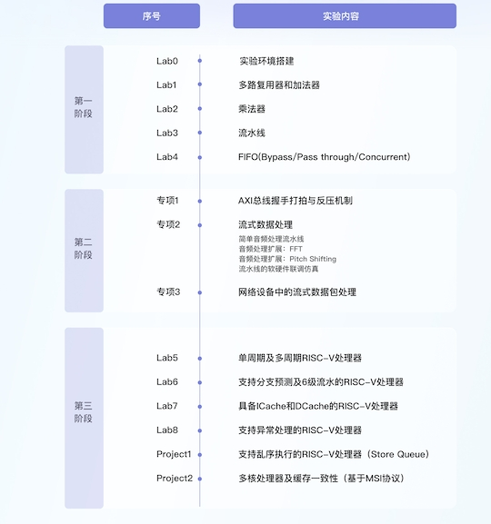

# datenlord
## 学习资料
https://zhuanlan.zhihu.com/p/636608731（MIT体系结构课程Q&A及小贴士）
https://gitee.com/wangxuan95/BSV_Tutorial_cn（bsv中文教程）
https://web.ece.ucsb.edu/its/bluespec/doc/BSV/user-guide.pdf（bsv英文文档）
https://csg.csail.mit.edu/6.175/index.html（6.175官网）
https://csg.csail.mit.edu/6.375/6_375_2019_www/index.html（6.375官网）

## 代码仓库
https://github.com/dmendelsohn/6.175（英文文档，无lab代码，仅project代码）
https://github.com/GTwhy/MIT_6.175（仅lab、project代码）
更多仓库参见MIT体系结构课程Q&A及小贴士

